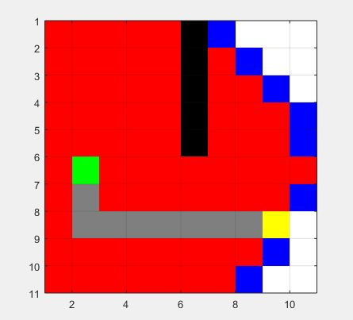
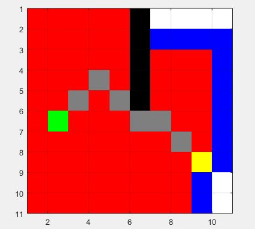
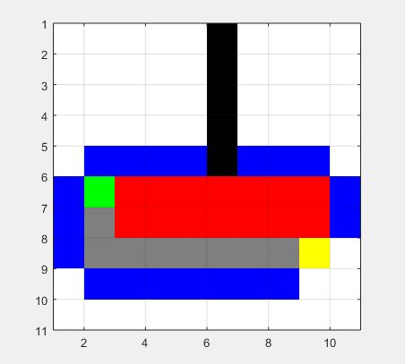
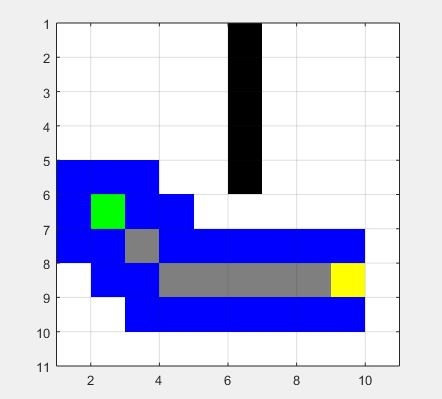

#Week 1 Programming Assignments Dijkstra and A*, MATLAB

The code section where updation occurs contains two cases where diagonal move is allowed and the other where it is not.

Dijkstra's Algorithm
Diagonal Move Disallowed

Diagonal Move Allowed

A* Algorithm

Diagonal Move Allowed

